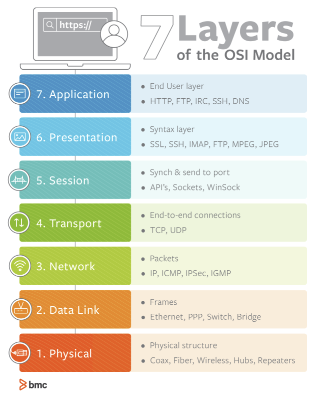

# CS
### 프로세스
메모리에서 현재 실행되고 있는 프로그램을 말한다.

### 스레드
프로세스 내에 하나의 실행 단위를 말한다. 프로세스내에서는 프로세스를 서로 공유할 수 있으며, 하나에 프로세스에서 다수의 스레드를 실행단위로 구분하는것을 **멀티스레드**라고 구분합니다.

멀티스레드를 쓰는 이유는 멀티프로세스보다 공유하는 통신비용이 덜 들고 할당되는 시스템콜이 감소할 수 있기 때문에 훨씬 효율적이다.

### DeadLock(교착상태)
프로세스가 자원을 얻지 못하여 다음 프로세스를 실행을 못하는 상태. 
한정된 자원보다 많은것을 사용하려고 할 때 발생됩니다.

교착상태의 조건
+ 상호배제 : 필요한 자원에 대해 배타적 통제권 요구
+ 점유대기 : 할당된 자원을 가진 상태에서 다른 자원을 기다림
+ 비선점 :  어떤 자원이 사용이 끝날때까지 다른 자원을 뺏어올 수 없다.
+ 순환대기 : 순차적으로 다음 프로세스가 요구하는 자원을 가지고 있음.

### RESTful API
http메서드를 통해 자원을 처리하는 방식이다.
+ 리소스와 행위를 명사적이고 직관적으로 분리
+ 행위는 http method get,post,put,patch,delete로 표현한다.
+ Header와 Body를 완전히 분리
    + Entity의 내용은 Body를 통하여 요청
+ API 버전관리

장점
+ 기존의 http 인프라를 그대로 사용할 수 있다.

단점
+ http메서드가 4개 밖에 없다.
+ http 통신 프로토콜에 대해서만 지원한다.

### HTTP Protocol
서버와 클라이언트가 데이터를 주고받기 위한 프로토콜이다.

응답코드
+ 1XX : 정보 확인
+ 2XX : 성공
    + 200 : 서버 요청 처리 성공
    + 201: 요청 접수 후 새 리소스 작성
+ 3XX : 리다이렉트
    + 301: 요청 페이지가 새 위치로 영구적 이동 (요청페이지 변경)
    + 302: 임시이동 요청자
+ 4XX : 클라이언트 오류
    + 400: 클라이언트 오류 (잘못된 클라이언트 요청)
    + 401: 권한 없음
    + 404: 서버에 요청한 리소스 찾을 수 없음
+ 5XX : 서버측 오류

### HTTP/HTTPS
http와 https의 차이점은 https는 http를 통신하느 소켓 부분을 SSL이라는 프로토콜로 대체한다.

+ HTTP동작순서 : TCP -> HTTP
+ HTTPS동작순서 : TCP -> SSL -> HTTP

SSL을 사용하지 않으면 암호화로 인해 속도 저하가 일어날 수 있다.

### SSL
Secure Socket Layer이라는 뜻으로 보완프르토콜을 통해 클라이언트와 서버가 통신하는것을 말합니다.
SSL을 사용하면 모든 데이터가 비공개로 전송됩니다.
SSL암호화를 사용해서 데이터 변조를 막습니다.

### 웹 통신의 흐름
1. 브라우저가 url을 입력한다.
2. 브라우저는 DNS 서버로 가서 웹사이트의 IP주소를 찾는다.
3. 브라우저는 서버에게 웹사이트의 사본을 보내달라는 **http요청 메세지**를 서버로 전송한다.
4. 브라우저의 요청을 받은 서버는 메세지를 클라이언트로 전송한다.
5. 서버는 응답할 파일들을 데이터 패킷이라는 곳에 저장하여서 작은 덩어리로 클라이언트로 전송한다.
6. 브라우저는 서버로부터 응답받은 데이터패킷을 조립해서 사용자에게 웹사이트를 보여준다.

### 쿠키
클라이언트에 저장된느 Key:Value값입니다. 유효시간 명시가 가능하며 주로 활용되는 곳은 자동로그인,장바구니,아이디 자동저장 입니다

### 세션
쿠키가 클라이언트에 저장된다면 세션은 서버에 데이터가 저장되는 것을 말합니다. 클라이언트가 http요청을 하면 서버엔진이 자동으로 유일한 id를 부여하는데 이것이 세션id입니다. 
브라우저를 종료시키면 자동으로 세션이 종료됨으로 보안은 좋지만 사용자가 많아지면 서버 메모리에 있어서 비표율적이다. 그렇기에 성능저하 문제가 발생할 수 있다.

**사용하는 이유** 

정보가 유지되지 않으면 사용자 입장에서 다른 페이지 한 번 갈때마다 계속 로그인과 인증을 해야하는 상황이 오기때문에 상태유지가 필요한 상황에서는 쿠키와 세션을 꼭 사용해야한다.

**쿠키 동작 순서** 
1. 클라이언트 페이지의 요청
2. 웹서버가 쿠키를 생성
3. 클라이언트에게 http응답을 할 때 생성된 쿠키도 함께 전송한다.
4. 서버에서 클라이언트로 전송한 세션id를 통해서 쿠키를 서버에 저장
5. 클라이언트가 재접속을 할때 세션id를 서버로 전송해서 정보를 유지시킨다.

**세션 동작 순서** 
1. 클라이언트 페이지의 요청
2. 서버는 클라이언트가 보낸 쿠키를 확인하고 클라이언트가 세션id를 전송했는지 확인
3. 세션id가 존재하지 않으면 세션id를 생성하고 클라이언트로 전송
4. 서버에서 클라이언트로 보내준 세션id를 활용하여서 서버에 저장
5. 클라이언트는 재접속시 쿠키를 이용해서 세션id를 서버로 전달

### stack
먼저들어온값이 가장 나중에 나가는 LIFO(Last In First Out)형식의 자료구조이다. 
+ pop : 가장 최근에 들어간 값을 삭제한다
+ push : 값을 삽입한다
+ top : 가장 최근의 값을 리턴한다.

### queue
큐는 가장 먼저 들어간 값이 가장 먼저 나가는 FIFO(First In First Out)형식의 자료구조이다. 

### OSI 참조모델
통신할 때 어떻게 메세지를 주고 받고 어떤 언어를 사용할 지 정하는 규칙, 이러한 규칙을 프로토콜이라고 한다.

**물리계층**
+ 데이터를 주고받는 기능을 수행

**데이터링크계층**
+ 물리계층으로 전송되는 정보를 안전하게 관리하는 기능을 수행
+ MAC 주소를 기반

**네트워크계층**
+ Router, IP
+ 데이터를 목적지까지 안전하고 빠르게 전송가능
+ IP주소를 지정하고 패킷데이터를 전송

**전송 계층**
+ TCP / UDP
+ 위 프로토콜을 통해 통신 활성화, 전송 역할

**세션 계층**
+ API, SOCKET
+ 데이터가 연결하기 위한 논리적 연결을 담당
+ TCP/IP 세션을 생성하고 삭제하는 역할

**표현 계층**
+ JPG, MPEG
+ 데이터 표현에 대한 인터페이스 제공

**응용 계층**
+ HTTP,DNS,FTP

### WAS와 Web Server의 차이

**Web Server**

웹 브라우저에서 특정 페이지를 요청할 때 서버에서 요청을 받아 정적 콘테츠를 제공하는 웹서버를 말한다. 웹서버는 동적콘텐츠뿐만 아니라 동적콘텐츠를 받으면 WAS에 해당 데이터를 전송합니다. 그리고 WAS를 다시 사용자에게 전송하는 다리역할도 할 수 있습니다.

**WAS**

WAS는 웹서버가 단독적으로 처리 할 수 없는 DB나 관련로직이 필요한 동적콘텐츠를 제공합니다. 현재는 WAS가 가진 웹서버에서도 정적콘텐츠를 처리하는데 있어서 성능상에 큰 문제는 없습니다.

**필요한 이유**
웹페이지는 동적,정적 콘텐츠를 모두 제공합니다. 동적콘텐츠는 사용자 목적에 맞게 제공해야 합니다. 

### DNS
인터넷 표준 프로토콜은 TCP/IP입니다. 이 프로토콜을 사용하는 네트워크 안에서 host를 식별하기 위한 목적으로 IP주소를 사용합니다. 길게 숫자로 이루어진 IP 주소를 사람이 읽기 편한 주소 이름으로 변환한 것을 말합니다. 대표적으로 DNS 서비스는 aws의 route 53이 해당됩니다.

