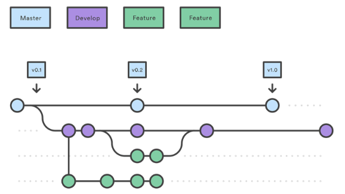

# Git-flow

말하자면 Git-flow는 기능이 아니고 서로간의 약속인 방법론이라는 점입니다.

### Git-flow는 총 5가지의 브랜치를 사용해서 운영을 합니다. 
+ master  : 배포하는 브랜치 입니다. 
+ develop : 개발 브랜치로 개발자들이 이 브랜치를 기준으로 각자 작업한 기능들을 합(Merge)칩니다. 
+ feature : 단위 기능을 개발하는 브랜치로 기능 개발이 완료되면 develop 브랜치에 합칩니다.
+ release : 배포를 위해 master 브랜치로 보내기 전에 먼저 QA(품질검사)를 하기위한 브랜치 입니다. 
+ hotfix  : master 브랜치로 배포를 했는데 버그가 생겼을 떄 긴급 수정하는 브랜치 입니다.

### 메인 브랜치
메인 브랜치는 `master`브랜치와 `develop`브랜치를 의미합니다.
+ master브랜치 : 배포가 가능한 상태를 관리하는 브랜치
+ develop브랜치 : 배포할 것을 개발을 하는 브랜치

### 보조 브랜치
보조 브랜치는 `feature`브랜치 또는 `topic`브랜치를 말합니다.

위에 그림을 보면 Master브랜치에서 develop브랜치를 만들고, develop브랜치에서 feature브랜치로 나눠 기능을 만들고 다시 develop브랜치로 합치는 것을 볼 수 있따.

devlop브랜치에는 기존에 잘 작동하는 코드들이 있고, 보조 브랜치에는 새로 변경될 개발코드를 분리하고 각각 보존하는 역할을 합니다. 
보조 브랜치는 기능을 완성할 때 까지 유지하고, 잘 작동하면 devlop브랜치로 merge하고 잘 작동하지 않으면 버린다.

### 순서
1. master에서 시작을 합니다.
2. develop브랜치를 만듭니다. 개발자들은 develop브랜치에서 개발을 합니다.
3. 개발자들이 기능을 만드려고 할 때 feature브랜치를 생성합니다.
4. feature브랜치에서 기능을 만들면 develop브랜치에 합칩니다.(merge)
5. 모든 것이 완료되면 develop브랜치를 release브랜치로 만듭니다. release에서 master로 보내기 전에 품질검사를 합니다. 품질검사를 하면서 보완해야할 점을 보완합니다.
6. release브랜치를 master,develop브랜치로 보냅니다. master에서 버전추가를 위한 태그를 생성하고 배포를 합니다.
7. 배포를 하고 버그가 발생되면 hotfix브랜치를 생성하여 버그를 고칩니다.

### Git-flow의 진행

Fork는 브랜치와 비슷하지만 프로젝트를 통째로 외부로 복제하여서 개발을 하는 방식입니다.
개발을 하고 바로 merge를 하는 것이 아니라 Pull requests로 원 프로젝트 관리자에게 머지를 보내고 원 프로젝트 관리자가 코드를 보고 적절하다고 생각하면 그 코드를 붙여서 기능을 완성하는 방식입니다.