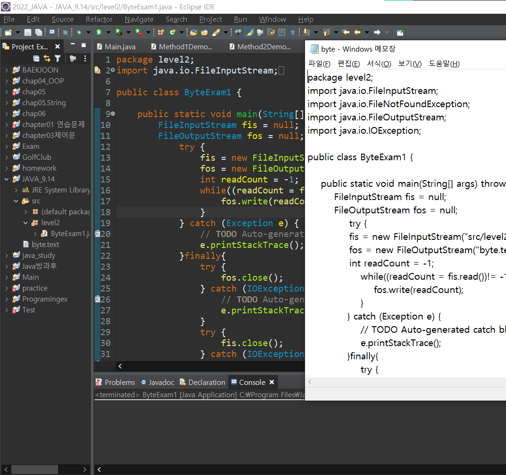

# 자바IO
+ 자바 IO는 크게 byte단위 입출력과 문자 단위 입출력클래스로 나뉩니다.
    + byte단위 입출력클래스는 모두 InputStream과 OutputStream이라는 추상클래스를 상속받아 만들어집니다.
    + 문자(char)단위 입출력클래스는 모두 Reader와 Writer라는 추상클래스를 상속받아 만들어집니다.
+ 4가지 추상클래스(InputStream,OutputStreamReader,Reader,Writer)를 받아들이는 생성자가 있다면, 다양한 입출력방법을 제공하는 클래스입니다.
+ 4가지 클래스를 받아들이는 생성자가 없다면, 어디로부터 입력받을 것인지, 어디에 쓸것인지를 나타내는 클래스입니다.
+ 파일로 부터 입력받고 쓰기 위한 클래스 : FileInputStream, FileOutputStream, FileReader, FileWriter
+ 배열로 부터 입력받고 쓰기 위한 클래스 : ByteArrayInputStream, ByteArrayOutputStream, CharReader, CharWriter
    + 해당 클래스들은 어디로부터, 어디에라는 대상을 지정할 수 있는 IO클래스입니다. 이런 클래스를 장식대상 클래스라고 합니다.
+ DataInputStream, DataOutputStream같은 클래스를 보면 다양한 데이터 형을 입력받고 출력합니다.
+ PrintWriter는 다양하게 한줄 출력하는 pintln()메소드를 가지고있습니다.
+ BufferedReader는 한줄 입력받는 readLine()메소드를 가집니다.
이런 클래스들은 다양한 방식으로 입력하고, 출력하는 기능을 제공합니다. 
    + 이런 클래스를 장식하는 클래스라고 합니다.

### FileInputStream
FileInputStream은 파일로 부터 읽어오기 위한 객체다.<br>
아래와 같이 io 패키지에서 import 하고 선언해야 한다.
```java
package level2;

import java.io.FileInputStream;

public class ByteExam1 {
	public static void main(String[] args) {
		FileInputStream fis = null;
    	fis = new FileInputStream("경로");
    }

}
```
("") 안에는 어떤 파일에서부터 읽어올 것인지에 대해 적어야 한다.<br>
그러니까 읽어들일 파일이 있는 경로와 파일명을 적어야 한다.<br>
프로젝트가 현재 경로인 것을 기준으로하여 작성한다.<br>
예시는 "src/level2/ByteExam1.java" 와 같다.

그런데 해당 경로에 파일이 없을 경우 발생하는 Exception에 대해
아래와 같이 예외처리를 해주어야 한다.
```java
package level2;
import java.io.FileInputStream;
import java.io.FileNotFoundException;
import java.io.IOException;

public class ByteExam1 {
	public static void main(String[] args) throws IOException {
    	FileInputStream  fis = null;
    
    	try {
            fis = new FileInputStream("src/level2/ByteExam1.java");
        	} catch (Exception e){
            e.printStackTrace();
    }
}
```
### FileOutputStream
FileOutputStream은 파일에 쓸 수 있게 해주는 객체다.<br>
import와 선언, 예외처리는 FileInputStream 과 동일한 방식으로 한다.<br>
다만 new FileOutputStream(""); 의 ("")안에는<br>
생성될 파일의 경로와 이름을 적는데,<br>
아무런 경로를 입력하지 않으면 프로젝트 밑의 위치에 생성된다.
```java
package level2;
import java.io.FileInputStream;
import java.io.FileOutputStream;
import java.io.FileNotFoundException;
import java.io.IOException;

public class ByteExam1 {
	public static void main(String[] args) throws IOException {
    	FileInputStream  fis = null;
    	FileOutputStream fos = null;
    	try {
            fis = new FileInputStream("src/level2/ByteExam1.java");
            fos = new FileOutputStream("byte.text");
        	} catch (Exception e){
            e.printStackTrace();
    }
}
```
### read(), write() 메소드
먼저, FileInputStream의 read() 메소드는 이름처럼 읽는 역할을 한다.
그리고 정수 4바이트 중 마지막 바이트에 읽어들인 한 바이트를 저장한다.
바이트를 리턴한다면 끝을 나타내는 값을 표현할 수 없기 때문에 int값을 리턴한다.
음수의 경우 맨 왼쪽 비트가 1이 되며, 읽어들일 것이 있다면 항상 양수를, 없다면 -1을 리턴한다.

그리고 FileOutputStream의 write() 메소드는 이름처럼 쓰기 역할을 한다.
이들을 활용해서 아래와 같이 반복문으로 데이터를 끝까지 읽어낼 수 있다.
```java
package level2;
import java.io.FileInputStream;
import java.io.FileOutputStream;
import java.io.FileNotFoundException;
import java.io.IOException;

public class ByteExam1 {
	public static void main(String[] args) throws IOException {
    	FileInputStream fis = null;
    	FileOutputStream fos = null;
    	try {
              fis = new FileInputStream("src/level2/ByteExam1.java");
              fos = new FileOutputStream("byte.text");
            int readCount = -1;
            while((readCount = fis.read()) != 1){
            	fos.write(readCount);
			}
        } catch (Exception e){
            e.printStackTrace();
    }
}
```
### close() 메소드
그리고 IO의 모든 객체들은 인스턴스화를 하고 나면 반드시 닫아줘야하기에<br>
finally 블록을 열고, close() 메소드를 사용한다.<br>
close 메소드는 InputStream, OutputStream 모두 존재한다.<br>
그리고 close() 메소드도 Exception을 발생시켜 예외 처리를 해야 한다.
```java
package level2;
import java.io.FileInputStream;
import java.io.FileNotFoundException;
import java.io.FileOutputStream;
import java.io.IOException;

public class ByteExam1 {

    public static void main(String[] args) throws IOException {
        FileInputStream fis = null;
        FileOutputStream fos = null;
        	try {
            	fis = new FileInputStream("src/level2/ByteExam1.java");
            	fos = new FileOutputStream("byte.text");
            	int readCount = -1; 
                while((readCount = fis.read())!= -1){
                    fos.write(readCount);
                }           
            } catch (Exception e) {
                // TODO Auto-generated catch block
                e.printStackTrace();
            }finally{
                try {
                    fos.close();
                } catch (IOException e) {
                    // TODO Auto-generated catch block
                    e.printStackTrace();
                }
                try {
                    fis.close();
                } catch (IOException e) {
                    // TODO Auto-generated catch block
                    e.printStackTrace();
                }
            }
        }
    }
```

그리고 나서 프로그램 실행 후, 프로젝트 경로에서 새로고침을 하면
내가 읽고자 했던 파일이, 내가 지정한 경로에 지정한 이름으로 생성된 것을 알 수 있다.

;